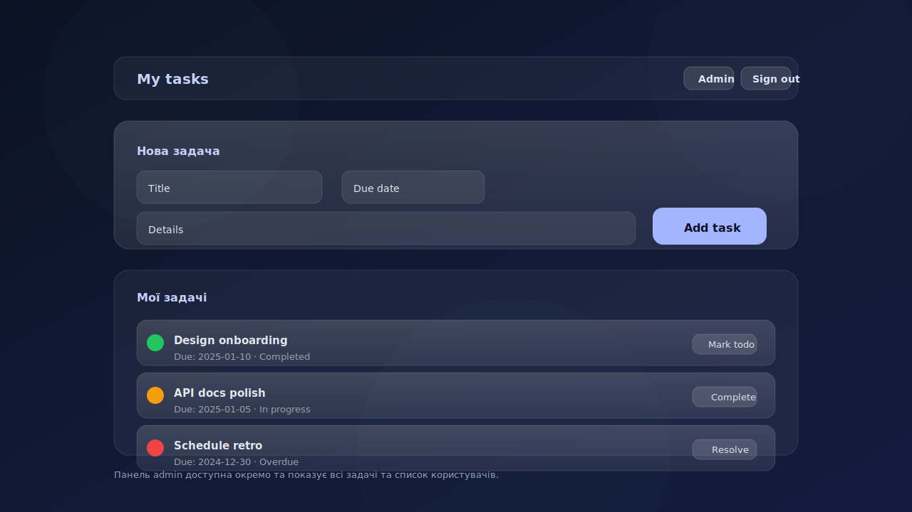

# Task Manager Web (Next.js App Router)

Frontend for the task manager built with Next.js 16 (App Router) + React 19 + TypeScript. Works as a BFF: Next API routes proxy requests to the Express API, adding the JWT from the httpOnly cookie. Middleware protects `/tasks` and `/admin`.



## Stack
- Next.js 16 (App Router), React 19, TypeScript 5
- Tailwind CSS v4
- Server Actions / server components, `next/headers` cookies

## Quick start
```bash
cd apps/web
npm install
```

Create `.env.local`:
```
BACKEND_URL=http://localhost:3001  # Express backend URL
APP_BASE_URL=http://localhost:3000 # public UI URL (redirects/server actions)
COOKIE_NAME=tm_token               # optional; defaults to tm_token
```

Run:
```bash
npm run dev    # http://localhost:3000
```

Build/production:
```bash
npm run build
npm run start  # after npm run build
```

Lint:
```bash
npm run lint
```

## Architecture and flows
- BFF: `/app/api/**` call `BACKEND_URL`, adding the Bearer token from the httpOnly cookie.
- Cookie is set in the login API route via `setTokenCookie`; “remember me” sets max-age to 7 days.
- Middleware (`middleware.ts`) redirects unauthenticated users from `/tasks`/`/admin` to `/login`, and non-admins from `/admin` to `/tasks`.
- UI pages:
  - `/` and `/register`: client-side registration forms.
  - `/login`: client-side login form + remember me.
  - `/tasks`: server page with a server action to create tasks; lists own tasks, toggle/edit/delete.
  - `/admin`: admin-only; all tasks with owner info + block/unblock users.

## Key paths (Next API → Express API)
- `POST /api/auth/register` → `/api/auth/register`
- `POST /api/auth/login` → `/api/auth/login`
- `POST /api/auth/logout` → clears cookie locally
- `GET /api/auth/profile` → `/api/auth/profile`
- `GET /api/tasks/my` → `/api/tasks/my`
- `POST /api/tasks/my` → `/api/tasks`
- `GET /api/tasks` → `/api/tasks` (admin only)
- `GET/PUT/DELETE /api/tasks/[id]` → `/api/tasks/:id`
- `GET /api/users` → `/api/users` (admin)
- `PATCH /api/users/[id]/block` → `/api/users/:id/block` (admin)

## Structure
```
apps/web/
├─ app/                 # App Router pages and API routes
│  ├─ api/auth/...      # BFF auth
│  ├─ api/tasks/...     # BFF tasks
│  ├─ api/users/...     # BFF users (admin)
│  ├─ tasks/            # tasks page
│  ├─ admin/            # admin panel
│  ├─ login/, register/ # auth UI
│  ├─ layout.tsx        # root layout
│  ├─ loading.tsx       # fallback
│  └─ error.tsx         # segment error
├─ components/          # UI components (TaskCard, UsersList)
├─ lib/                 # backend fetch helper, cookie/session utils
├─ types/               # Task, User types
├─ public/              # static assets
└─ middleware.ts        # route protection
```

## UI notes
- Server components by default; client components only for interactive forms/cards.
- Tailwind v4 utility-first; gradient backgrounds; lightweight UI without extra libraries.
- `TaskCard` supports toggle, edit, delete; `UsersList` handles block/unblock with error states.

## Limitations
- No frontend automated tests yet.
- Form validation is basic; for production add stricter schemas and rate limiting on the BFF.
